# Ocular Region Reconstruction Based on FLAME

3D scan can bu used to generates high quality 3D data. However, the scan result for eyes, including eyeballs and eyebrow usually has large distortion. This code use [FLAME](http://flame.is.tue.mpg.de/) repository to reconstruct ocular region where 3D scan data is unreliable based on ocular region excluding the distorted parts. 

The idea is to obtain a accurate 3DMM of ocular region so that further works like attach eyelash to eyelid can be done automatically. To achieve this, we want to give more weight in modeling region around eyes. And, since the scan result for the eyeballs is inaccurate, we need to remove that region during reconstruction. Third, we provide pipline to automatically mark landmarks on 3D face model and generate face reconstruction result that focus on ocular region.

To start, you need three 3D object file for the same face. A color front view scan of the face in .ply format (color_model_path in example.py). The same front view scan without color and with ocular region removed in .obj format (scan_path_unsure in example.py). The same front view scan without color and with eyeballs manually removed in .obj format (scan_path_interested in example.py). 

Then run:
   example.py 
it will generate result under ./output folder.

Sample 3D face model for test can be downloaded from here.
    https://pan.baidu.com/s/1bKKfLs8YEbYuSYkyQ5zH4g   -password：gcy6
    https://pan.baidu.com/s/1Ez_uqpUbxer6s_I8pwGBkA   -password：d0me
    https://pan.baidu.com/s/1223eM9mu80_NI8RTdgq96g   -password：jb0d
    
## Input
.ply file
<p align="center"> 
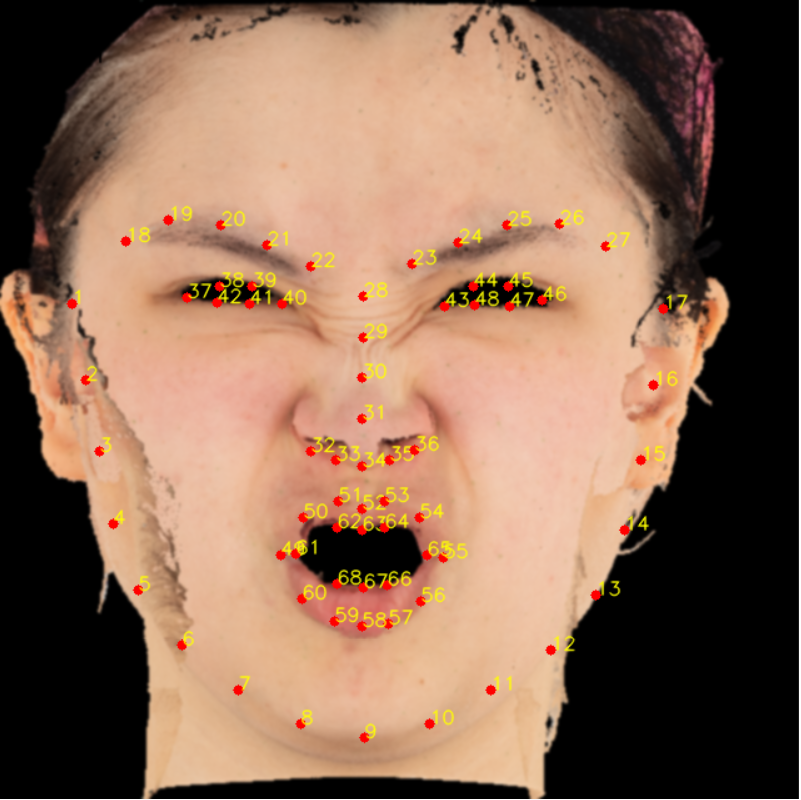
</p>

.obj file
<p align="center"> 
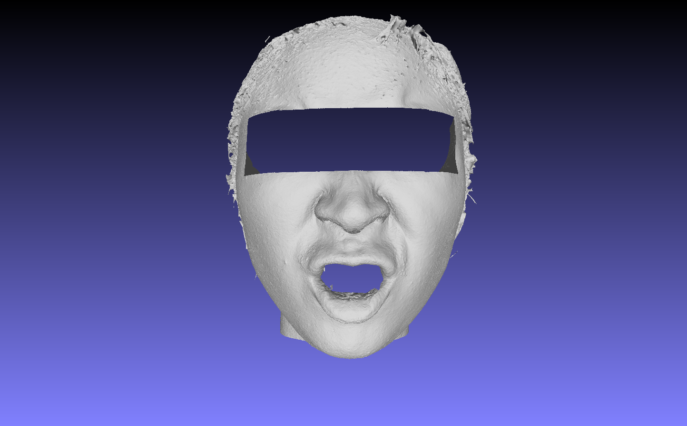
</p>

.obj file with eyeballs removed
<p align="center"> 
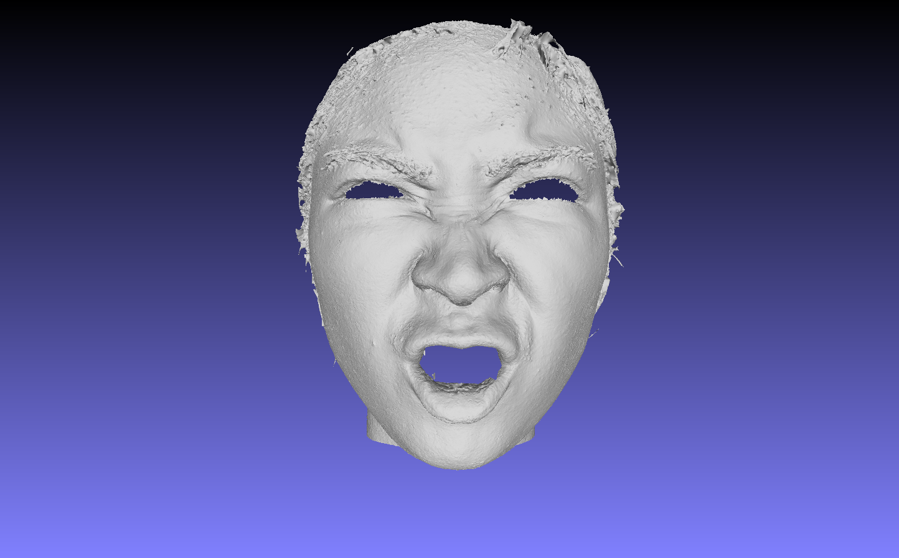
</p>

## Output
<p align="center"> 
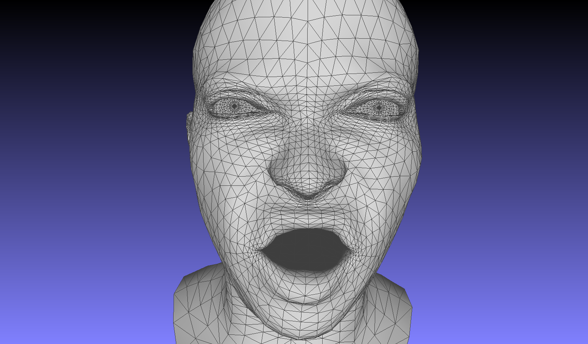
</p>

<p align="center"> 
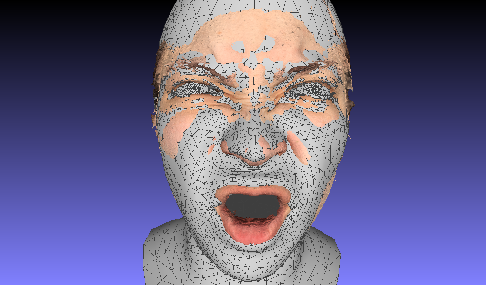
</p>

<p align="center"> 
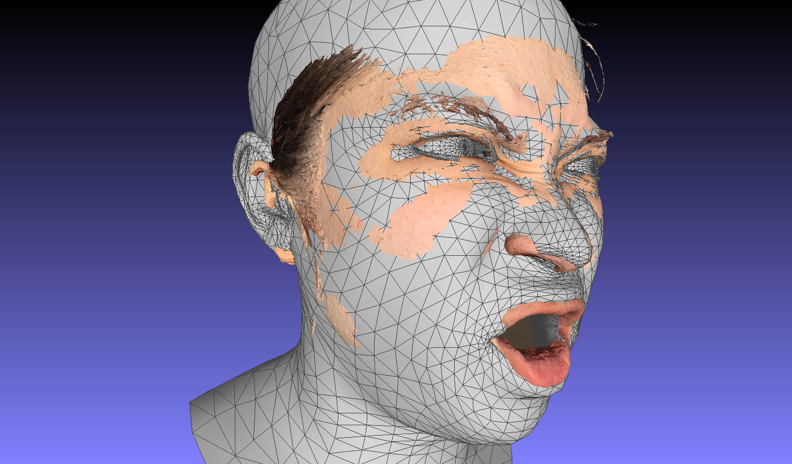
</p>

<p align="center"> 
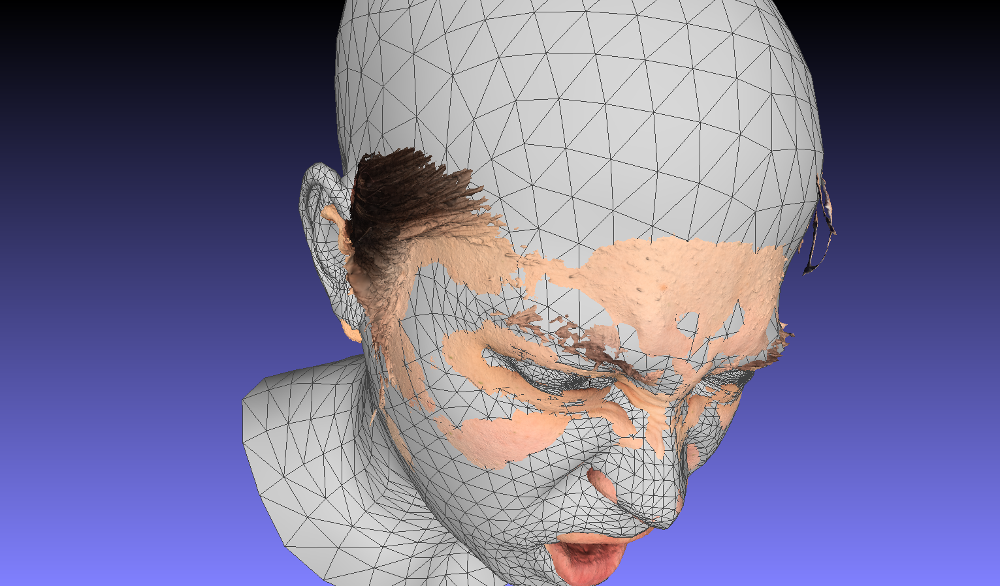
</p>
    
# FLAME Guide

## Setup:
(forked from FLAME:https://github.com/Rubikplayer/flame-fitting/blob/master/README.md)

We also provide [Tensorflow FLAME](https://github.com/TimoBolkart/TF_FLAME) and [PyTorch FLAME](https://github.com/HavenFeng/photometric_optimization) frameworks, and code to [convert from Basel Face Model to FLAME](https://github.com/TimoBolkart/BFM_to_FLAME).

<p align="center"> 

</p>

FLAME is a lightweight and expressive generic head model learned from over 33,000 of accurately aligned 3D scans. FLAME combines a linear identity shape space (trained from head scans of 3800 subjects) with an articulated neck, jaw, and eyeballs, pose-dependent corrective blendshapes, and additional global expression blendshapes. For details please see the [scientific publication](https://ps.is.tuebingen.mpg.de/uploads_file/attachment/attachment/400/paper.pdf)

```
Learning a model of facial shape and expression from 4D scans
Tianye Li*, Timo Bolkart*, Michael J. Black, Hao Li, and Javier Romero
ACM Transactions on Graphics (Proc. SIGGRAPH Asia) 2017
```
and the [supplementary video](https://youtu.be/36rPTkhiJTM).

This codebase demonstrates
 * **Sampling:** Load and evaluate FLAME model for random parameters
 * **Landmark fitting:** Fit FLAME to 3D landmarks
 * **Scan fitting:** Fit FLAME to a 3D scan

<p align="center"> 
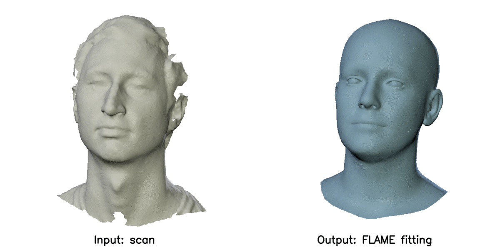
</p>

### Set-up

The code has been tested with Python 3.6.9.

Clone the git project:
```
git clone https://github.com/Rubikplayer/flame-fitting.git
```

Install pip and virtualenv

```
sudo apt-get install python3-pip python3-venv
```

Set up virtual environment:
```
mkdir <your_home_dir>/.virtualenvs
python3 -m venv <your_home_dir>/.virtualenvs/flame-fitting
```

Activate virtual environment:
```
cd flame-fitting
source <your_home_dir>/.virtualenvs/flame-fitting/bin/activate
```

Make sure your pip version is up-to-date:
```
pip install -U pip
```

Somerequirements can be installed using:
```
pip install -r requirements.txt
```

Install mesh processing libraries from [MPI-IS/mesh](https://github.com/MPI-IS/mesh) within the virtual environment.

The scan-to-mesh distance used for fitting a scan depends on Eigen. Either download Eigen for [here](http://eigen.tuxfamily.org/index.php?title=Main_Page) OR clone the repository:
```
git clone https://gitlab.com/libeigen/eigen.git
```
After downloading Eigen, you need to compile the code in the directory 'sbody/alignment/mesh_distance'. To do this go to the directory:
```
cd sbody/alignment/mesh_distance
```
Edit the file setup.py to set EIGEN_DIR to the location of Eigen. Then type:
```
make
```

### Data

Download the FLAME model [MPI-IS/FLAME](https://flame.is.tue.mpg.de/downloads). You need to sign up and agree to the model license for access to the model.
Download RCHigh_trimmed_ocular_region.obj, RCHigh_trimmed_color.ply, RCHigh_trimmed.obj from pan.baidu.com following the link bellow. Put them into ./data file
链接：https://pan.baidu.com/s/1d5sR7DP6q0VptLLclcImDA 
提取码：8en9 
复制这段内容后打开百度网盘手机App，操作更方便哦
Note: data for this project must be preprocessed because we use dlib to automatically annotate landmarks on projection of 3D face mesh. The figure in scan must face the +z axis. You can check the projection.png to see whether the scan orient in a wrong direction or not. The two .obj files should contain only vertices (no color). The .pkl file is for generating landmarks, so, it must contain color. For all three scans, the resolution of the scan should be in "cm"

### Demo

 * you can run example.py, which will generate sample_index.npy, landmarks_3d_51_points.npy and reconstruction output fit_region_scan_result.obj under ./output 
 * you can run find_sampler_indexes.py to generate sample_index.npy under the ./data file
 * you can run generate_landmarks.py to generate landmarks_3d_51_points.npy under ./data file
 * after the two file has been generated, you can run fit_scan_region.py to generate fit the region specified by sample_index.npy.

Fitting a scan requires scan and FLAME model to be in the same local coordiante systems. The `fit_scan.py` script provides different options by specifying the variable `scale_unit` to convert from Meters [m] (default), Centimeters [cm], or Milimieters [mm]. Please specify the right unit when running `fit_scan.py`. If the unit of the measurement unit is unknown, choose `scale_unit = 'NA'`.


### RCHigh_trimmed.obj
<p align="center"> 

</p>

### RCHigh_trimmed_ocular_region.obj
<p align="center"> 

</p>

### RCHigh_trimmed_color.ply
<p align="center"> 

</p>

### landmarks
<p align="center"> 

</p>

### output
<p align="center"> 
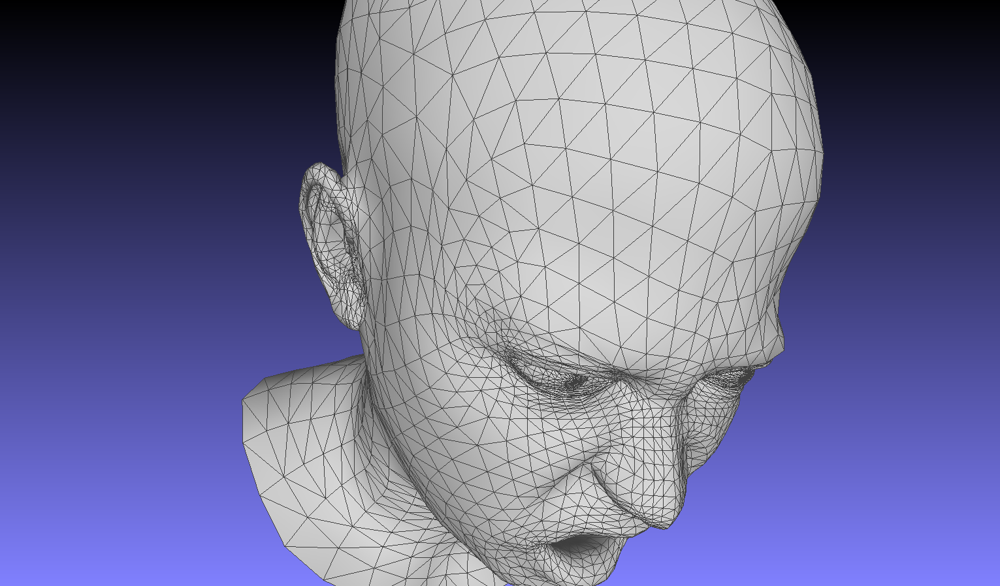
</p>

<p align="center"> 
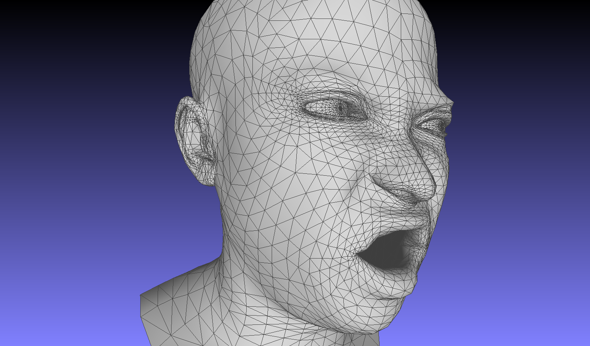
</p>

<p align="center"> 
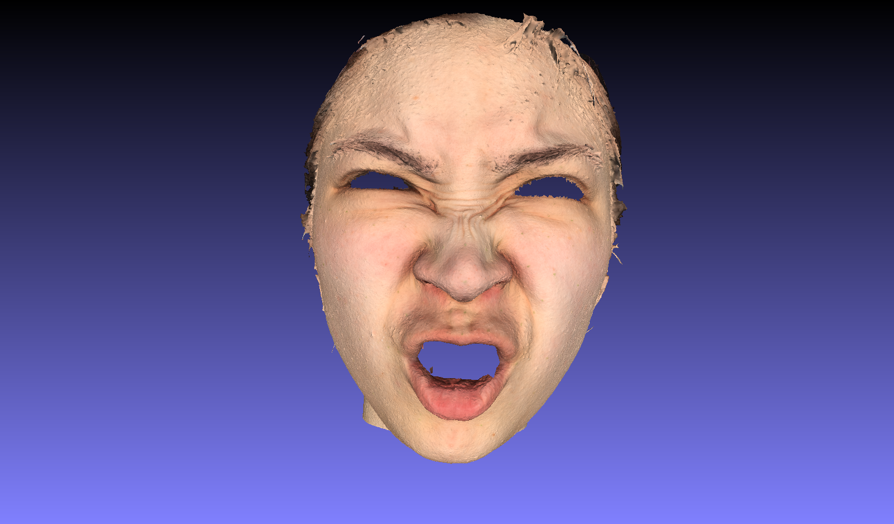
</p>

<p align="center"> 

</p>


We project 3D scan into a 2D image and use dlib to automatically annotate landmarks on the projected image. Then, we traceback to the closest point in the scan data and mark it as a landmark.

